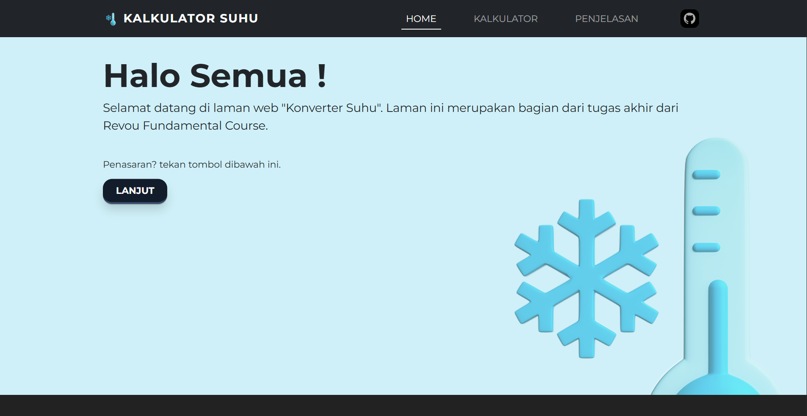
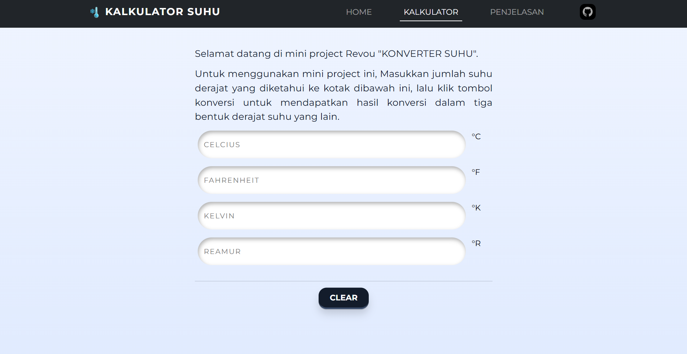
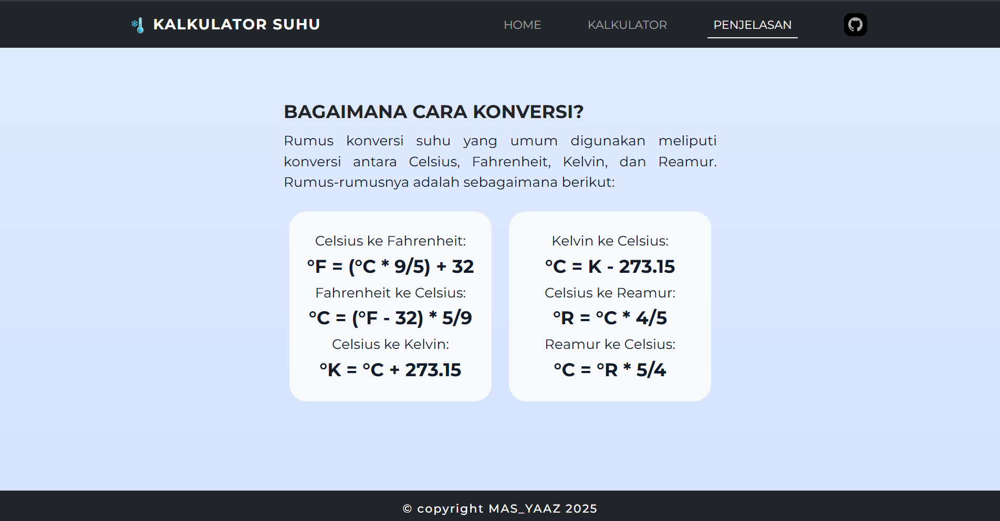

# WEBSITE KONVERTER SUHU
Website ini berguna untuk mengkonversi satuan suhu dari Celcius, Fahrenheit, Reamur & Kelvin secaran mudah dan cepat.

## UI (Antar Muka Desain Web)

Ini adalah tampilan pertama laman web ini.
 
 

Ini adalah tampilan Konverter Suhu.
 
 

Ini adalah tampilan Penjelasan tentang rumus konversi suhu.
 
 

## FUNGSI & KELEBIHAN
- Mengkonversikan satuan suhu baik itu Celcius, Fahrenheit, Reamur & Kelvin.
- Antarmuka pengguna (UI) mudah untuk digunakan.
- Web Responsif

## BAHASA

- HTML
- CSS
- Javascript (js)

## FRAMEWORKS

- Bootstrap

## CARA PENGGUNAAN
- Buka web
- Masukkan jumlah satuan suhu yang diketahui pada textbox input
- Jika Ingin Menghapus tulisan di textbox input, Tekan clear.

## LINK WEB
Untuk melihat website ini silahkan klik link berikut [ini.](https://revou-fundamental-course.github.io/21-apr-25-MasYaaz/)
